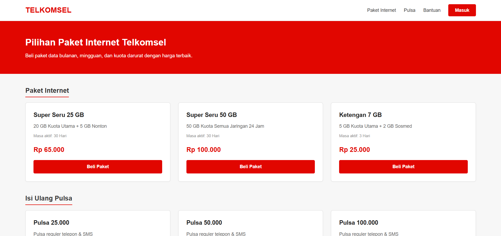
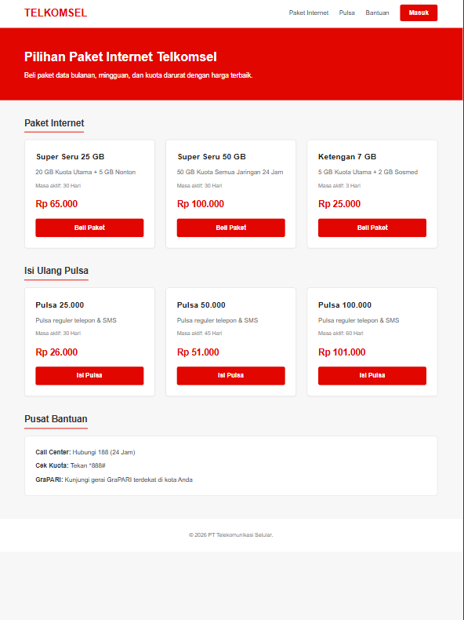
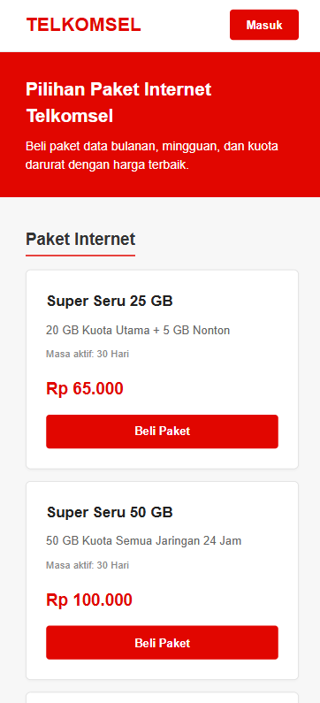

# Landing Page Telkomsel

Proyek ini adalah website sederhana hasil slicing halaman Telkomsel menggunakan HTML, CSS, dan JavaScript.

---

## Tampilan

| Perangkat | Gambar |
| :--- | :---: |
| Laptop |  |
| Tablet |  |
| HP |  |

---

## Fitur

- Menampilkan daftar paket internet dan pulsa.
- Tampilan responsif untuk layar laptop, tablet, dan HP.
- Menu navigasi otomatis ringkas di layar HP dan hanya menampilkan tombol Masuk.
- Tombol Beli menampilkan pop up psan untuk memasukkan nomor HP.
- Tombol Masuk menampilkan pop up pengiriman kode OTP.

---

## Teknologi yang Digunakan

- HTML
- CSS
- JavaScript
- Vercel (Deployment)